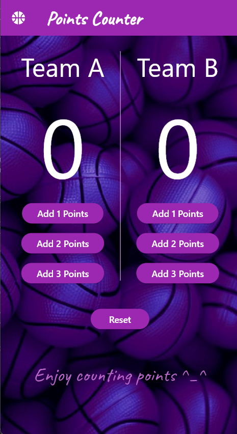
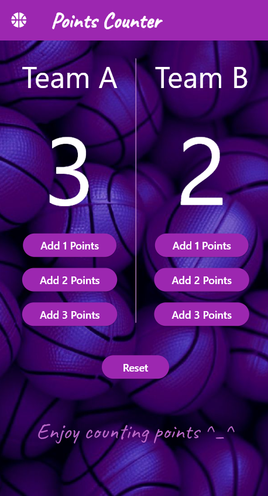

# Counter Points

A simple Flutter counter application using Cubit for state management.

## Features
- Increment and decrement counter
- State management using Cubit
- Simple and clean UI

## Screenshots


   
  


## Getting Started

This project is a starting point for a Flutter application.

### Prerequisites
Ensure you have Flutter installed. You can check by running:
```sh
flutter --version
```

### Installation
Clone the repository and run the app:
```sh
git clone https://github.com/yourusername/counter_points.git
cd counter_points
flutter pub get
flutter run
```

### Resources
A few resources to get you started:
- [Lab: Write your first Flutter app](https://docs.flutter.dev/get-started/codelab)
- [Cookbook: Useful Flutter samples](https://docs.flutter.dev/cookbook)
- [Flutter Documentation](https://docs.flutter.dev/)

## License
This project is licensed under the MIT License - see the [LICENSE](LICENSE) file for details.

---

Feel free to contribute or suggest improvements!
